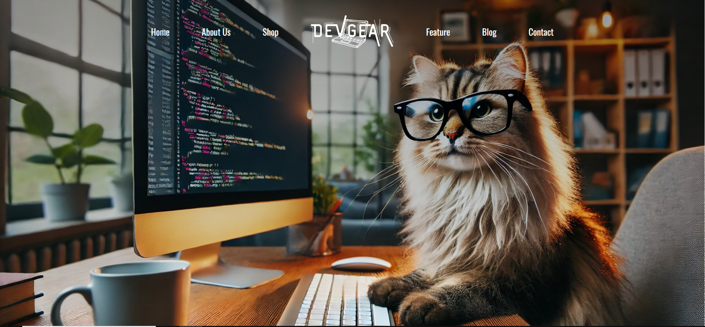

# devGear

devGear is a fictional e-commerce site tailored for tech enthusiasts, offering a curated selection of tools and gear. This project showcases a responsive landing page, complete with sections for ‘About Me,’ ‘Gear Favorites,’ and a blog. A fun detail: the featured cat, Charlie, is an AI-generated image of my own cat, pictured coding at a computer while sporting glasses!

## Built with

- HTML
- CSS
- JavaScript

## What I learned by building this project?

This project marked my first experience using AI to generate an image. I uploaded a picture of my cat, along with a prompt, to create a unique background image for devGear. I also designed the shop's logo in Canva and used some new techniques for the 'About Me' section, including wrapping text around an image by adjusting container width. Additionally, I embedded a .mp4 video on the page. I’m excited about devGear's potential and plan to develop it beyond a landing page into a full website with a shop and checkout feature.

    Check it out the landing page <a href="https://ceceliabraswell.github.io/devGear/">here</a>!

